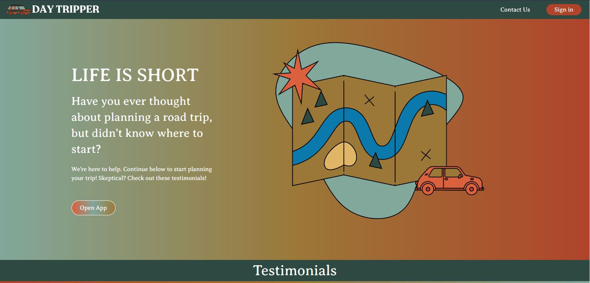
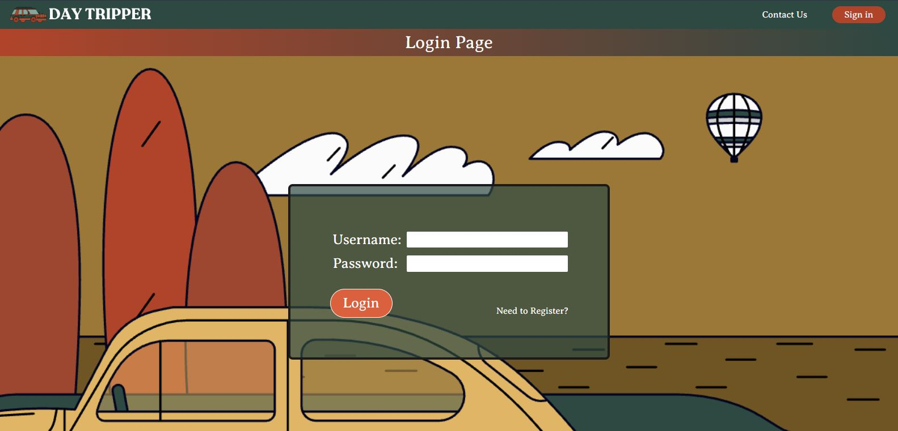
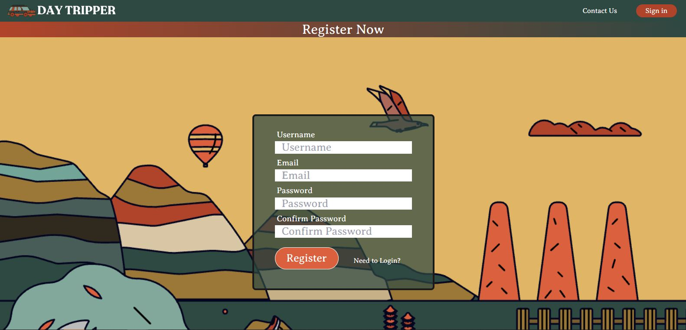
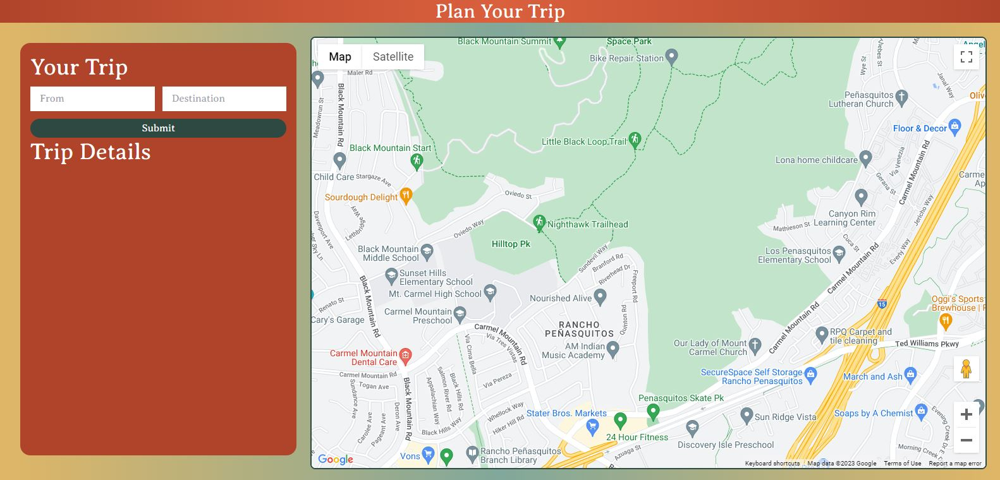
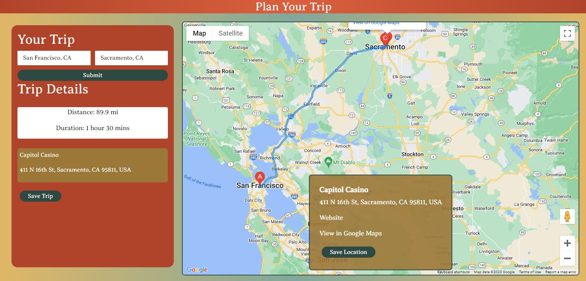
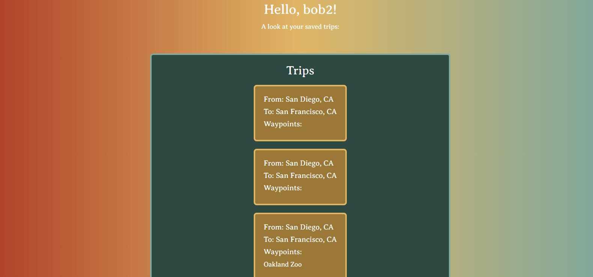

# [daytripper](https://daytripper-app-1577e78f3877.herokuapp.com/)

## Description

Tired of the same old routine? Get ready to embark on spontaneous adventures with 'DayTripper', the must-have web application for planning and saving your perfect road trips.

With 'DayTripper', your journey begins the moment you log in. Seamlessly create, customize, and save your road trip itineraries directly into your personal account. No more scribbled notes or lost plans – 'DayTripper' keeps everything neatly organized for you.

## Features

- Log in and Create an Account
- Create Road Trips using a simple and responsive map application
- See your saved trips in a page, so you can track your trips!

## Table of Contents

- [Installation](#installation)
- [Usage](#usage)
- [Credits](#credits)
- [License](#license)

## Installation

[LIVE DEPLOYMENT IN HEROKU](https://daytripper-app-1577e78f3877.herokuapp.com/)

If you want to locally deploy the web application:

1. Make sure you have [NodeJS](https://nodejs.org/en) and [MongoDB Compass](https://www.mongodb.com/products/compass) installed on your computer.
2. Download the repository onto your computer, and extract it to a directory of your choosing.
3. In your preferred command-line application (Git Bash, Terminal, etc.), `cd` onto your directory and type `npm i` to download the needed dependencies for the web application.
4. Because this application uses the Google Platforms API, you will need to create an environment variable for the token key.

## Usage

Upon first accessing the application, you will be greeting with the homepage.

On the top-right of the page, there is a 'Sign In' button that allows you to Register or Log in to an account.

After registering/logging in, you will be redirected back to the homepage. In the middle of the page, there is an 'Open App' button that redirects you to the Trip Planner page.

Map page after filling up data, adding waypoints by clicking on the map's points of interest, and having trip details on left of page.

On the navbar on the top of the page after logging in, you will see a 'Trips' tab. Upon clicking on the tab, you will redirected to a page with your saved trips.

## Credits

Thank you to all collaborators for this project!

**Ray Badua**
[GitHub](https://github.com/epicasino)
[LinkedIn](https://www.linkedin.com/in/ray-badua/)

**Chelsea Pratte**
[GitHub](https://github.com/callmechelsea)
[LinkedIn](https://www.linkedin.com/in/callmechelsea/)

**Alison Colao**
[GitHub](https://github.com/acolao)
[LinkedIn](https://www.linkedin.com/in/alisoncolao/)

**Jose Perez**
[GitHub](https://github.com/joseperez013)
[LinkedIn](https://www.linkedin.com/in/jose-perez-472444286/)

[Google Maps API Data provided by Google Platforms API](https://developers.google.com/maps/apis-by-platform)

## License

MIT License

Copyright (c) 2023 Ray Badua, Chelsea Pratte, Alison Colao, Jose Perez

Permission is hereby granted, free of charge, to any person obtaining a copy
of this software and associated documentation files (the "Software"), to deal
in the Software without restriction, including without limitation the rights
to use, copy, modify, merge, publish, distribute, sublicense, and/or sell
copies of the Software, and to permit persons to whom the Software is
furnished to do so, subject to the following conditions:

The above copyright notice and this permission notice shall be included in all
copies or substantial portions of the Software.

THE SOFTWARE IS PROVIDED "AS IS", WITHOUT WARRANTY OF ANY KIND, EXPRESS OR
IMPLIED, INCLUDING BUT NOT LIMITED TO THE WARRANTIES OF MERCHANTABILITY,
FITNESS FOR A PARTICULAR PURPOSE AND NONINFRINGEMENT. IN NO EVENT SHALL THE
AUTHORS OR COPYRIGHT HOLDERS BE LIABLE FOR ANY CLAIM, DAMAGES OR OTHER
LIABILITY, WHETHER IN AN ACTION OF CONTRACT, TORT OR OTHERWISE, ARISING FROM,
OUT OF OR IN CONNECTION WITH THE SOFTWARE OR THE USE OR OTHER DEALINGS IN THE
SOFTWARE.
